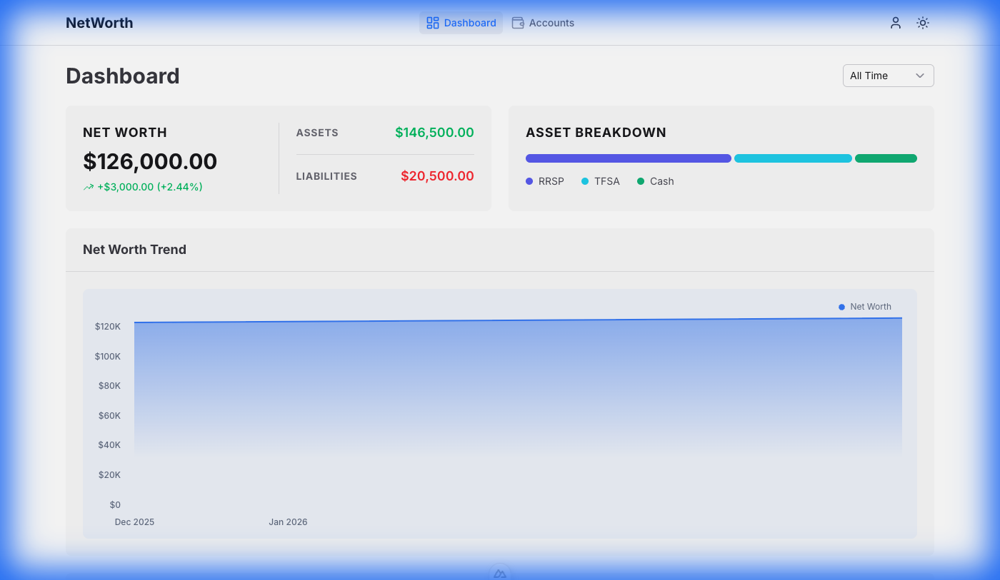

# Worths

A modern, privacy-focused net worth tracking web application built with Nuxt 4 and Nuxt UI. All data is stored locally in your browser using IndexedDB.



## Features

- **📊 Visual Insights**: Track your net worth over time with dynamic area charts.
- **🏦 Account Management**: Manage multiple accounts with categories (TFSA, RRSP, Cash, Loan, etc.) and owner assignments.
- **🔄 Balance Updates**: Easily update account balances and maintain a historical record of your financial progress.
- **🔒 Private & Local**: Your data never leaves your device. Powered by **Dexie.js** and **IndexedDB**.
- **🎨 Modern UI**: Clean, responsive interface built with **Nuxt UI v4**.

## Tech Stack

- **Framework**: [Nuxt 4](https://nuxt.com)
- **UI Components**: [Nuxt UI v4](https://ui.nuxt.com)
- **Database**: [Dexie.js](https://dexie.org) (IndexedDB)
- **Charts**: [Nuxt Charts](https://github.com/wobsoriano/nuxt-charts)
- **Form Validation**: [Zod](https://zod.dev)
- **Utilities**: [VueUse](https://vueuse.org)

## Getting Started

### Prerequisites

- [Node.js](https://nodejs.org) (Version 20 or higher recommended)
- [pnpm](https://pnpm.io)

### Installation

1. Clone the repository or download the source code.
2. Install dependencies:
   ```bash
   pnpm install
   ```

### Development

Start the development server with hot-reload:
```bash
pnpm dev
```

### Production

Build the application for production:
```bash
pnpm build
```

Preview the production build:
```bash
pnpm preview
```

## Project Structure

- `app/components/`: Reusable Vue components (Charts, Forms, Lists).
- `app/composables/`: Shared logic for database access (`useDatabase`) and net worth calculations (`useNetWorth`).
- `app/pages/`: Application routing and main views.
- `app/types/`: TypeScript definitions and Zod schemas.

## License

MIT
